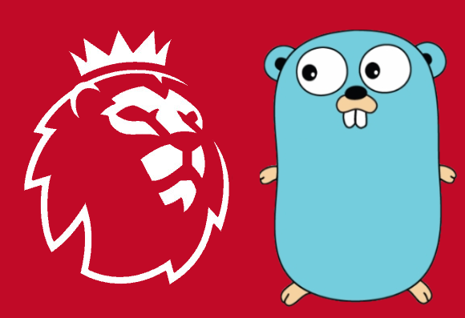

<h1 align="center"> FPL </h1> <br>
<p align="center">
  
</p>

<p align="center">
  A Go CLI tool for Fantasy Premier League
</p>

<!-- START doctoc generated TOC please keep comment here to allow auto update -->
<!-- DON'T EDIT THIS SECTION, INSTEAD RE-RUN doctoc TO UPDATE -->
## Table of Contents

- [Introduction](#introduction)
- [Pre-requisites](#pre-requisites)
- [Installation](#installation)
- [Configuration](#configuration)
  - [Configuring your team ID](#configuring-your-team-id)
  - [Configuring your rivals](#configuring-your-rivals)
- [Dockerfile](#dockerfile)
- [Acknowledgements](#acknowledgements)

<!-- END doctoc generated TOC please keep comment here to allow auto update -->

## Introduction


[](https://goreportcard.com/report/github.com/paddymorgan84/fpl)

`fpl` is a CLI tool written in Go that pulls information from the Fantasy Premier League API and presents it in a readable format.

```text

                ________    _______      ___
                |   ____|   |   _  \     |  |
                |  |__      |  |_)  |    |  |
                |   __|     |   ___/     |  |
                |  |        |  |         |  -----.
                |__|        |__|         |_______|

                A CLI tool for retrieving FPL data

Usage:
  fpl [command]

Available Commands:
  details     Returns details of manager for current season, e.g. league standings, cash in the bank, overall points etc
  fixtures    Get the fixtures for a specific gameweek
  help        Help about any command
  history     Returns history for a managers current and past seasons
  points      Get the points for a specified gameweek (defaults to latest active gameweek)
  rivals      Show the points for all of your rivals (specified in config) for a specified gameweek

Flags:
      --config string     config file (default is $HOME/.fpl.yaml)
  -g, --gameweek string   The gameweek you wish to see details for
  -h, --help              help for fpl
  -t, --toggle            Help message for toggle

Use "fpl [command] --help" for more information about a command.
```

## Pre-requisites

- [Go version 1.18 or higher](https://golang.org/dl/)

## Installation

Installing the tool is very straightforward:

```bash
git clone https://github.com/paddymorgan84/fpl.git
cd fpl
go install
```

## Configuration

`fpl` accepts a config file called `.fpl.yaml`, by default it will search your home directory.

### Configuring your team ID

Setting a default team ID prevents the need for you to provide it when you want to use `fpl` for your own team.

```yaml
team-id: 1327470
```

You can get your FPL team id via the Gameweek History page, linked on your FPL squad page. Simply click that link and check the URL displayed in your browser. You should see something like this:

`http://fantasy.premierleague.com/entry/xxxx/history/`

### Configuring your rivals

You can add your rivals team ID's to allow you to see their points for a specified gameweek

```yaml
rivals:
  - 2619024
  - 1818664
  - 3108094
```

You can obtain their FPL team id via the same method specified [above](#configuring-your-team-id).

## Dockerfile

If you have Docker installed, you can also run the tool using the Dockerfile provided:

```bash
docker build -t paddymorgan84/fpl .
docker run --rm -t -v "${HOME}/.fpl.yaml":/root/.fpl.yaml paddymorgan84/fpl
```

## Acknowledgements

- Shoutout to [Frenzel Timothy](https://medium.com/@frenzelts) for his [how-to guide](https://medium.com/@frenzelts/fantasy-premier-league-api-endpoints-a-detailed-guide-acbd5598eb19) on using the Fantasy Premier League API 👏
- I've used [Cobra](https://github.com/spf13/cobra) to help me create the scaffolding for a Go CLI tool. I would highly recommend it 👍
